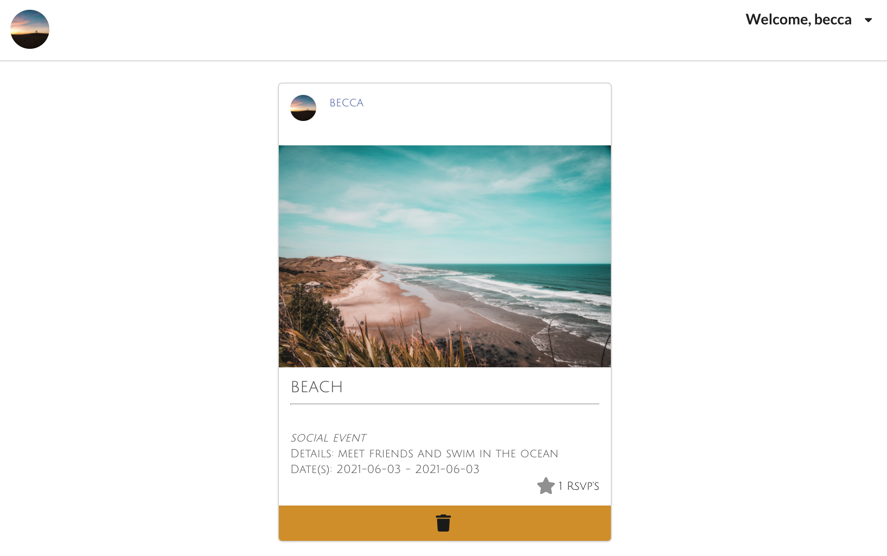

# Eventime

Eventime was created for the purpose to discover new and exciting events coming up. With this app, you are able to make an account and create event postings. Other users can then see the event and rsvp which adds to the total rsvp list. You can see other users profiles with the intent to make new connections.

### ERD 

### Wireframes 

### Log in
Create your account or log in to get started

### Home Page 

### Profile Page

## Technologies Used 
- HTML
- CSS
- Javascript
- MongoDB
- React
- Node
- Heroku

## Getting Started

[View my trello board here](https://trello.com/b/4P2jw59L/project-4)

[Click here to launch events](https://socialeventapp.herokuapp.com/)

## Next Steps
- Edit more features such as post details or users bio
- Implement a calendar that is connected to RSVP events
- Filter feature for searching events on home page
- Follow other users to see their profile/events easier
- Add a past events section, once the date has past, the events will move to that sections

